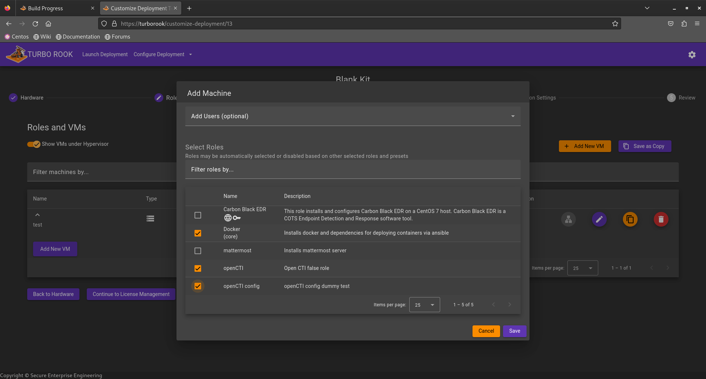
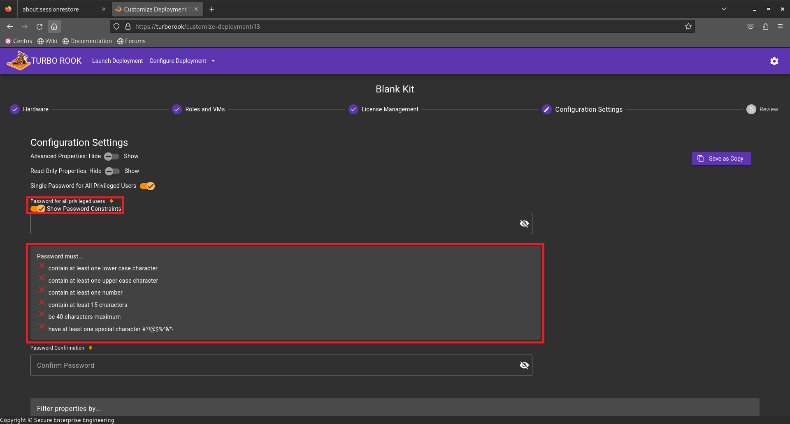

### Navigate to the proper folder to prepare to download your role
On the TURBO ROOK Provisioning Laptop
Open up a terminal
Change directories to the local roles folder
&nbsp;&nbsp;&nbsp;&nbsp;cd /opt/rook-provisioner/local/roles
&nbsp;&nbsp;&nbsp;&nbsp;(local roles will override roles that are used by `rookengine` by default)

### Navigate to github to prepare cloning down your role
Open up firefox
Navigate to github and your ansible role.
&nbsp;&nbsp;&nbsp;&nbsp;https://github.com/"**PUT YOUR ROLE IN HERE!**"/ansible-role-docker
To find the link to clone the role:
&nbsp;&nbsp;&nbsp;&nbsp;Click on the green square that says `<> Code`
&nbsp;&nbsp;&nbsp;&nbsp;copy the HTTPS url displayed

 **CANNOT TAKE THIS SCREEN SHOT UNTIL WE HAVE A GOOD URL FOR THE PROJECT**

### Using the terminal to clone your project down
Return to your command prompt and run the command to clone down your project
&nbsp;&nbsp;&nbsp;&nbsp;You will want to type `git clone`, paste the url you just copied, and finally enter the name of the role (following the convention of `<collection name>.<role name>`)
&nbsp;&nbsp;&nbsp;&nbsp;e.g. git clone https://github.com/"**PUT YOUR ROLE IN HERE!!!**"/ansible-role-docker.git **PUT YOUR ROLE IN HERE!!!**.ansible-role-docker
Your role will be downloaded into your /opt/rook-provisioner/local/roles
&nbsp;&nbsp;&nbsp;&nbsp;use `ls` to confirm it exists as expected

  **CANNOT TAKE THIS SCREEN SHOT UNTIL I KNOW THE URL TO THE GIT PROJECT**

### Adding your Role to the TURBO ROOK UI
Now return to the web browser with Turbo Rook open
Add "**/Admin**" to the end of the URL
&nbsp;&nbsp;&nbsp;&nbsp;This opens Turbo Rook's Admin page

On the left sidebar, click on `Software` to open up a drop down menu.
&nbsp;&nbsp;&nbsp;&nbsp;Select `Roles`

In the upper right side of the screen you will see an `+ Add New` button

When clicked you will be brought to the `Add Role` screen

&nbsp;&nbsp;&nbsp;&nbsp;**Role Name**
&nbsp;&nbsp;&nbsp;&nbsp;&nbsp;&nbsp;&nbsp;&nbsp;Human-Readable role name
&nbsp;&nbsp;&nbsp;&nbsp;**Ansible Role Location**
&nbsp;&nbsp;&nbsp;&nbsp;&nbsp;&nbsp;&nbsp;&nbsp;The name of the role as saved on disk (`<collection name>.<role name>`)
&nbsp;&nbsp;&nbsp;&nbsp;**Description**
&nbsp;&nbsp;&nbsp;&nbsp;&nbsp;&nbsp;&nbsp;&nbsp;Write a description of your role
&nbsp;&nbsp;&nbsp;&nbsp;Scroll down
&nbsp;&nbsp;&nbsp;&nbsp;&nbsp;&nbsp;&nbsp;&nbsp;You do not need to enter or adjust any of the following advanced settings:
&nbsp;&nbsp;&nbsp;&nbsp;&nbsp;&nbsp;&nbsp;&nbsp;&nbsp;&nbsp;&nbsp;&nbsp;Source URL
&nbsp;&nbsp;&nbsp;&nbsp;&nbsp;&nbsp;&nbsp;&nbsp;&nbsp;&nbsp;&nbsp;&nbsp;Source Tag
&nbsp;&nbsp;&nbsp;&nbsp;&nbsp;&nbsp;&nbsp;&nbsp;&nbsp;&nbsp;&nbsp;&nbsp;Hypervisor
&nbsp;&nbsp;&nbsp;&nbsp;&nbsp;&nbsp;&nbsp;&nbsp;&nbsp;&nbsp;&nbsp;&nbsp;Suport Level
&nbsp;&nbsp;&nbsp;&nbsp;&nbsp;&nbsp;&nbsp;&nbsp;&nbsp;&nbsp;&nbsp;&nbsp;Supports commercial software licenses
&nbsp;&nbsp;&nbsp;&nbsp;&nbsp;&nbsp;&nbsp;&nbsp;&nbsp;&nbsp;&nbsp;&nbsp;Works Offline
&nbsp;&nbsp;&nbsp;&nbsp;&nbsp;&nbsp;&nbsp;&nbsp;&nbsp;&nbsp;&nbsp;&nbsp;Manage Role Relationships
&nbsp;&nbsp;&nbsp;&nbsp;&nbsp;&nbsp;&nbsp;&nbsp;&nbsp;&nbsp;&nbsp;&nbsp;Load Role from File
&nbsp;&nbsp;&nbsp;&nbsp;Next, select Valid Systems for your Role:
&nbsp;&nbsp;&nbsp;&nbsp;&nbsp;&nbsp;&nbsp;&nbsp;For this instance your role should be set to be valid on both a Server and VM
&nbsp;&nbsp;&nbsp;&nbsp;&nbsp;&nbsp;&nbsp;&nbsp;Under the Server column select the box next to `Ubuntu 22.04-desktop`
&nbsp;&nbsp;&nbsp;&nbsp;&nbsp;&nbsp;&nbsp;&nbsp;Under the VM column select the box next to `Ubuntu 22.04-desktop`

You do not need to set any System Requiremnts for this example
You may now scroll to the bottom of the page and click `Save`

### You are now ready to Provision a device with your newly added role!

On the top bar of TURBO ROOK click on `Launch Deployment`
&nbsp;&nbsp;&nbsp;&nbsp;For a Deployment Type select `Blank`

You will be brought to the `Blank Kit` page.

&nbsp;&nbsp;&nbsp;&nbsp;Look to the right side of the screen for the ` + Add Machine ` button

We will now walk throught the `Add Hardware` Pop up

&nbsp;&nbsp;&nbsp;&nbsp;**Host Name**
&nbsp;&nbsp;&nbsp;&nbsp;&nbsp;&nbsp;&nbsp;&nbsp;Enter your Host Name
&nbsp;&nbsp;&nbsp;&nbsp;**Select Machine Type**
&nbsp;&nbsp;&nbsp;&nbsp;&nbsp;&nbsp;&nbsp;&nbsp;Click the box and select `Server` from the drop down

&nbsp;&nbsp;&nbsp;&nbsp;**Select Operating System**
&nbsp;&nbsp;&nbsp;&nbsp;&nbsp;&nbsp;&nbsp;&nbsp;Click the box and select `ESXi 7 (core)` from the drop down

&nbsp;&nbsp;&nbsp;&nbsp;Turn on the toggle switch for `Existing` to enable the ability to utilize the existing ESXi networking

&nbsp;&nbsp;&nbsp;&nbsp;**Hypervisor IP Address**
&nbsp;&nbsp;&nbsp;&nbsp;&nbsp;&nbsp;&nbsp;&nbsp;Enter the IP Address of the Server you are going to provision
&nbsp;&nbsp;&nbsp;&nbsp;**Hypervisor Username**
&nbsp;&nbsp;&nbsp;&nbsp;&nbsp;&nbsp;&nbsp;&nbsp;Enter the Username for the Existing ESXi
&nbsp;&nbsp;&nbsp;&nbsp;**Hypervisor Password**
&nbsp;&nbsp;&nbsp;&nbsp;&nbsp;&nbsp;&nbsp;&nbsp;Enter the Password for the Existing ESXi

&nbsp;&nbsp;&nbsp;&nbsp;The rest of the options below are optional and you do not need to fill them in
&nbsp;&nbsp;&nbsp;&nbsp;Scroll down and click the toggle to turn off `Run Eclypsium Scan` and `Wipe Disk Partitions before Deploying Operating Systems` 
&nbsp;&nbsp;&nbsp;&nbsp;&nbsp;&nbsp;&nbsp;&nbsp;These are on by default but cannot be run against existing ESXi hypervisors.

&nbsp;&nbsp;&nbsp;&nbsp;Select `Save`

&nbsp;&nbsp;&nbsp;&nbsp;Click `Continue to Roles and VMs`

On this screen select `Add New VM` on the left of the screen below your ESXI instance

&nbsp;&nbsp;&nbsp;&nbsp;**Host Name**
&nbsp;&nbsp;&nbsp;&nbsp;&nbsp;&nbsp;&nbsp;&nbsp;Enter your host name
&nbsp;&nbsp;&nbsp;&nbsp;**Select Operating System**
&nbsp;&nbsp;&nbsp;&nbsp;&nbsp;&nbsp;&nbsp;&nbsp;Click the box and select `Ubuntu 22.04-desktop (beta)` from the drop down
&nbsp;&nbsp;&nbsp;&nbsp;**Virtual Machine Properties**
&nbsp;&nbsp;&nbsp;&nbsp;&nbsp;&nbsp;&nbsp;&nbsp;The Hypervisor drop down will already be auto populated with the `ESXi` already entered

&nbsp;&nbsp;&nbsp;&nbsp;The remainaing options are optional and not needed for this example
&nbsp;&nbsp;&nbsp;&nbsp;Scroll down to the `Select Roles` section
&nbsp;&nbsp;&nbsp;&nbsp;&nbsp;&nbsp;&nbsp;&nbsp;Here you will select the box next to the following roles:
&nbsp;&nbsp;&nbsp;&nbsp;&nbsp;&nbsp;&nbsp;&nbsp;&nbsp;&nbsp;&nbsp;&nbsp;`Docker (core)`
&nbsp;&nbsp;&nbsp;&nbsp;&nbsp;&nbsp;&nbsp;&nbsp;&nbsp;&nbsp;&nbsp;&nbsp;`Open CTI`
&nbsp;&nbsp;&nbsp;&nbsp;&nbsp;&nbsp;&nbsp;&nbsp;&nbsp;&nbsp;&nbsp;&nbsp;`YOUR OWN ADDED ROLE`

&nbsp;&nbsp;&nbsp;&nbsp;When completed, click `Save`

You can now click on the ESXi machine and a drop down will populate showing your added VM

Now click The button to `Continue to License Management`

You do not need to do anything on this page
Click the button to `Continue to Configuration Settings`

On The `Configuration Settings` Page the only action you need to do is Create and Confirm your defined password for the deployment.
&nbsp;&nbsp;&nbsp;&nbsp;There is a toggle switch that allows your to `Show Password Consstraints`.

Once you have defined your password you can click the button to the bottom of the page that says `Continue to Review.`

Now take a moment to Review your Deployment selections, once complete, click `Start Provisioning Deployment.`

Select `Accept` on the EULA Agreement to begin.

Lastly you will be brought to the `Build Progress` page where you can monitor the progress of your deployment.

